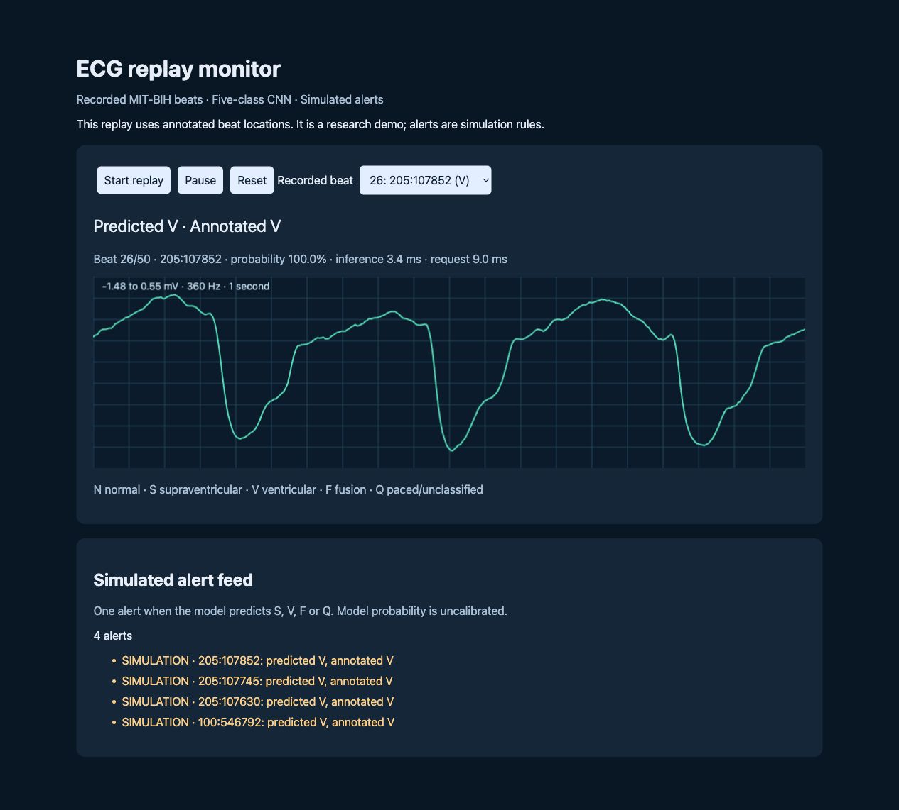

# ECG CV evidence closure

New verified five-class model and working replay monitor: [cv-closure](cv-closure/README.md). **109,438 beats; 94.10% patient-disjoint test accuracy; fusion recall 0/384.** See full metrics before making performance claims.

# Subject-aware ECG beat classification

This branch preserves the original course artifacts and adds the new personal research work through 3 October 2026.

- [Current status](research-workbench/CURRENT_STATUS_2026-10-03.md)
- [Plain-language HTML walkthrough](research-workbench/output/portfolio_progress_explained_2026-10-03.html) — download/open locally
- [Implementation and checks](research-workbench/implementation/README.md)
- [First audit](research-workbench/FIRST_SCAN_2026-09-27.md)
- [Original README](LEGACY_README.md) — historical claims, corrected by the audit

## Status

Past-only timing remains the provisional development reference with the existing CNN. The 18-cell subject-adversarial objective test completed job 22007333 in 391 GPU seconds. All six zero-penalty controls reproduced prior confusion counts. Validation selected weight 0.05, improving mean macro F1 from 0.5843 to 0.6005 on MIT and 0.4984 to 0.5168 on INCART. It nevertheless failed the frozen MIT F false-positive limit (9.67 versus 5.83), so retain the existing combined model. F detection remains poor; no clinical or fresh-confirmation claim follows.

Read [the full subject-objective result](research-workbench/ECG_SUBJECT_ADVERSARY_RESULT_2026-10-03.md) for S/F precision/recall, false positives, mixed effects and independent checks. Exact-input checks previously found no cross-source identical windows; transformed-record/patient independence is still unproven. EDB remains unscored and SVDB sealed. Annotation-assisted peaks and centered waveform latency remain explicit limitations.

The HTML walkthrough and earlier reports remain historical snapshots.

## Snapshot layout

`research-workbench/implementation` holds project code and compact evidence. Shared foundation helpers and cross-project reports preserve dependencies and the original audit trail. Large raw datasets, checkpoints, model caches, and virtual environments remain external.

Historical reports record earlier stopping points. Read the current status before interpreting older pending statements. The new work does not establish clinical deployment, autonomous-research superiority, or unpublished benchmark claims.

## Project page and interview guide

See the [project landing page](showcase/index.html) and [technical interview guide](showcase/guide.html). Download the HTML files and open them in a browser; GitHub displays their source.
